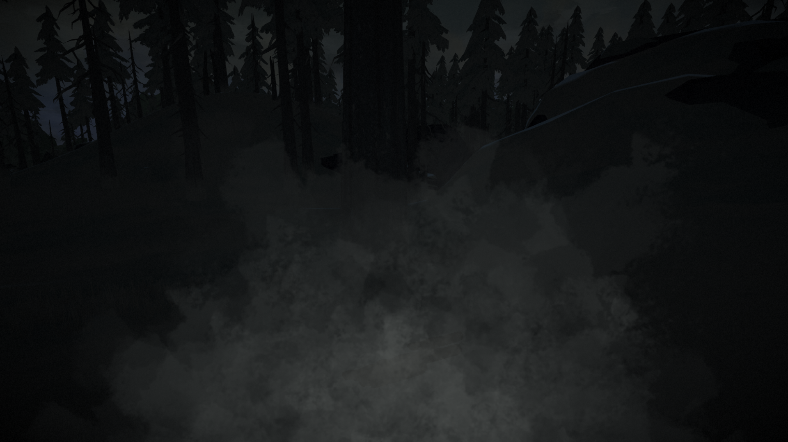
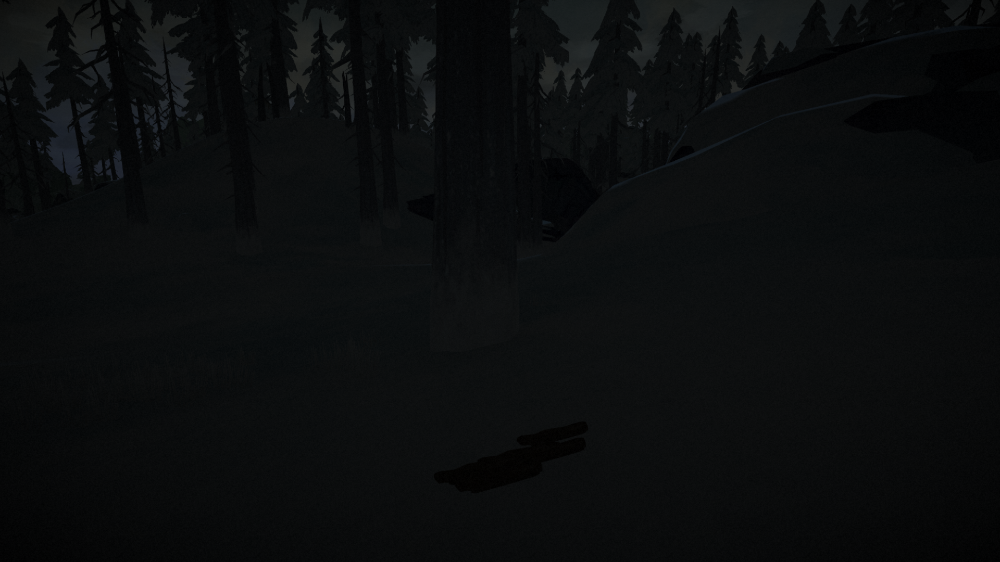

# DisableBreathEffect

A mod for The Long Dark that removes the annoying 2D breath cloud that appears every few seconds when it's cold.

This breath effect is especially annoying in dark scenes, as it can completely obscure the vision of objects lying on the ground.

Finally, if you're using an older or integrated graphics card, installing this game may even improve the performance of your game.

## Installation

1. If you haven't done so already, install MelonLoader by downloading and running [MelonLoader.Installer.exe](https://github.com/HerpDerpinstine/MelonLoader/releases/latest/download/MelonLoader.Installer.exe)
2. Download the latest version of `DisableBreathEffect.dll` from the [releases page](https://github.com/zeobviouslyfakeacc/DisableBreathEffect/releases)
3. Move `DisableBreathEffect.dll` into the Mods folder in your TLD install directory

## Screenshots

Before, without *DisableBreathEffect*:

After, with *DisableBreathEffect*:

